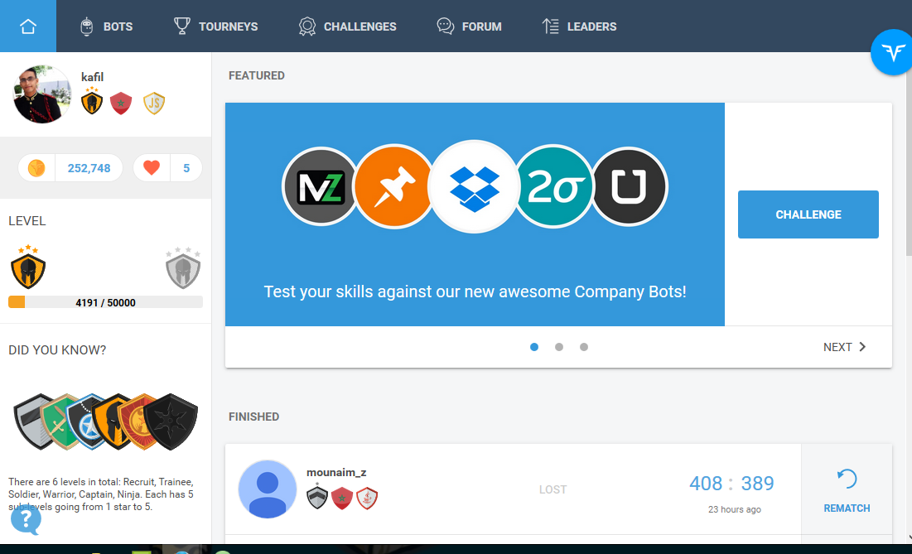

# CodeSignal solutions

My solutions to some of the tasks and challenges faced on [CodeFights](https://www.codefights.com)

**This a cool repo :)**

## Codefriend

Here is my [profile](https://codefights.com/profile/kafil), feel free to codefriend me and challenge me for a fight.

## Contributions

Any help solving unsolved tasks or proposing new and better solutions is more than welcome.

I'm currently only working on the `Javascript` version of the solutions as I'm learning the language, If anyone is interested in providing solutions in others languages such as `C++`,`Java`,`C#`,`Pyton`,`PHP`or `Ruby` feel free to make a pull request.

## Spread the word

Also feel free to fork and create your own repo, star this project for more updates as I push new solutions every now and then.

**Cheers**

